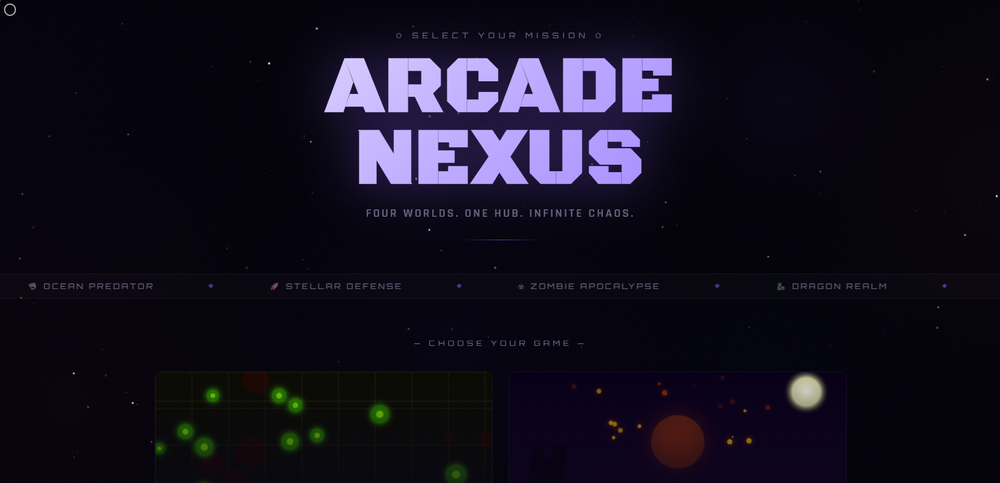
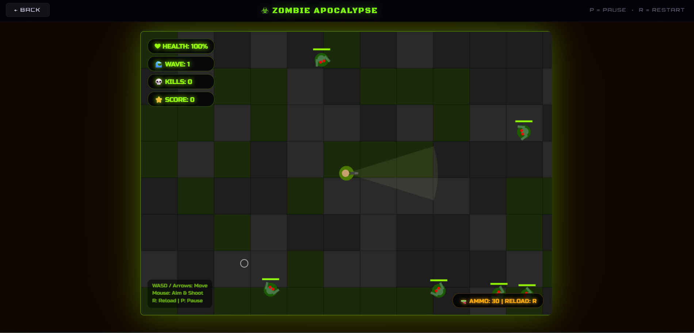
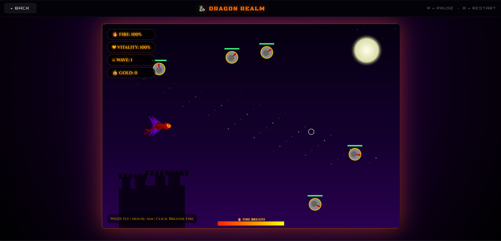
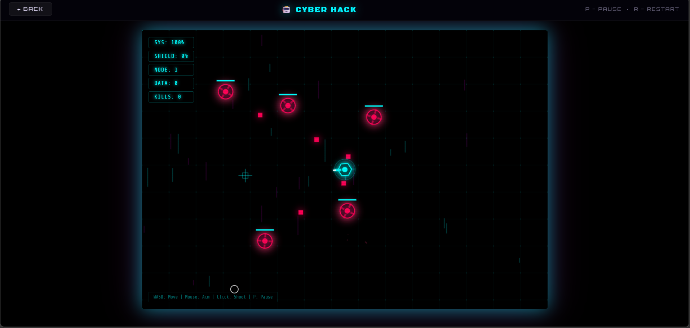
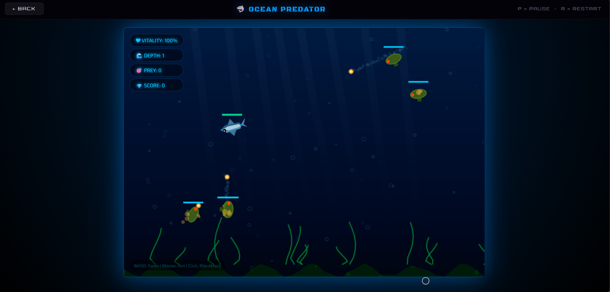

# 🕹️ ARCADE NEXUS

<div align="center">

```
 █████╗ ██████╗  ██████╗ █████╗ ██████╗ ███████╗
██╔══██╗██╔══██╗██╔════╝██╔══██╗██╔══██╗██╔════╝
███████║██████╔╝██║     ███████║██║  ██║█████╗  
██╔══██║██╔══██╗██║     ██╔══██║██║  ██║██╔══╝  
██║  ██║██║  ██║╚██████╗██║  ██║██████╔╝███████╗
╚═╝  ╚═╝╚═╝  ╚═╝ ╚═════╝╚═╝  ╚═╝╚═════╝ ╚══════╝

███╗   ██╗███████╗██╗  ██╗██╗   ██╗███████╗
████╗  ██║██╔════╝╚██╗██╔╝██║   ██║██╔════╝
██╔██╗ ██║█████╗   ╚███╔╝ ██║   ██║███████╗
██║╚██╗██║██╔══╝   ██╔██╗ ██║   ██║╚════██║
██║ ╚████║███████╗██╔╝ ██╗╚██████╔╝███████║
╚═╝  ╚═══╝╚══════╝╚═╝  ╚═╝ ╚═════╝ ╚══════╝
```

**A cinematic game hub with 4 fully playable browser-based action games.**

[](https://developer.mozilla.org/en-US/docs/Web/HTML)
[](https://developer.mozilla.org/en-US/docs/Web/CSS)
[](https://developer.mozilla.org/en-US/docs/Web/JavaScript)
[](https://developer.mozilla.org/en-US/docs/Web/API/Canvas_API)

[**▶ Play Now**](#-getting-started) · [**Games**](#-the-games) · [**Controls**](#-controls) · [**Credits**](#-credits)

</div>

---

## 📸 Screenshots

### 🏠 Game Hub — Main Menu


### ☣ Game 1 — Zombie Apocalypse


### 🐉 Game 2 — Dragon Realm


### 🤖 Game 3 — Cyber Hack


### 🦈 Game 4 — Ocean Predator

```

### 🏠 Game Hub — Main Menu

```
┌─────────────────────────────────────────────────────────────────────┐
│  ✦  ·  ✦       ★  ·         ·    ✦      ·   ★          ·   ✦      │
│                                                                       │
│              ⬡ SELECT YOUR MISSION ⬡                                 │
│                                                                       │
│           █████╗ ██████╗  ██████╗ █████╗ ██████╗  ███████╗          │
│          ██╔══██╗██╔══██╗██╔════╝██╔══██╗██╔══██╗ ██╔════╝          │
│          ███████║██████╔╝██║     ███████║██║  ██║ █████╗            │
│          ██╔══██║██╔══██╗██║     ██╔══██║██║  ██║ ██╔══╝            │
│          ██║  ██║██║  ██║╚██████╗██║  ██║██████╔╝ ███████╗          │
│          ╚═╝  ╚═╝╚═╝  ╚═╝ ╚═════╝╚═╝  ╚═╝╚═════╝  ╚══════╝          │
│                    N E X U S                                          │
│              FIVE WORLDS. ONE HUB. INFINITE CHAOS.                   │
│  ─────────────────────────────────────────────────────────────────  │
│  ☣ ZOMBIE APOCALYPSE ◆ 🐉 DRAGON REALM ◆ 🤖 CYBER HACK ◆ 🦈 OCEAN  │
│  ─────────────────────────────────────────────────────────────────  │
│                   — CHOOSE YOUR GAME —                               │
│  ┌──────────────────────┐  ┌──────────────────────┐                 │
│  │  [zombie preview]    │  │  [dragon preview]    │                 │
│  │  ☣ ZOMBIE            │  │  🐉 DRAGON            │                 │
│  │  APOCALYPSE          │  │  REALM               │                 │
│  │  ▶ PLAY NOW →        │  │  ▶ PLAY NOW →        │                 │
│  └──────────────────────┘  └──────────────────────┘                 │
│  ┌──────────────────────┐  ┌──────────────────────┐                 │
│  │  [cyber preview]     │  │  [ocean preview]     │                 │
│  │  🤖 CYBER HACK        │  │  🦈 OCEAN             │                 │
│  │                      │  │  PREDATOR            │                 │
│  │  ▶ PLAY NOW →        │  │  ▶ PLAY NOW →        │                 │
│  └──────────────────────┘  └──────────────────────┘                 │
└─────────────────────────────────────────────────────────────────────┘
  ↑ Each card has a LIVE animated canvas preview unique to its theme
```

---

### ☣ Game 1 — Zombie Apocalypse

```
┌─────────────────────────────────────────────────────────────────────┐
│ ❤ HEALTH: 85%  │  🌊 WAVE: 3  │  💀 KILLS: 14  │  ⭐ SCORE: 4200  │
│═════════════════════════════════════════════════════════════════════│
│  ▓▓▒░░   ▓▓▓▒   ░▒▓▓   ░░▒▓   ▓▒░   ▒▓▓░   ░▒▓▓  [city tiles]   │
│                                                                      │
│     Z         Z                   Z    Z                            │
│       (☠)         (☠)  (☠)              (☠)      ← glowing zombies  │
│              Z              Z                                        │
│                       ▶──────●  ← bullet trail                      │
│                    [🧍]          ← your survivor (top-down)          │
│                       ▶──────●                                       │
│         (☠)                        (☠)  (☠)                         │
│                [TANK]                                                │
│                (☠☠☠)  ← tank zombie, bigger & slower                │
│                                                                      │
│  🔫 AMMO: 22/30                              COMBO x5 [1.5x]        │
└─────────────────────────────────────────────────────────────────────┘
  Background: dark city grid · Blood stains persist on floor
  Enemies: Normal 🟢 · Runner 🟡 (fast) · Tank 🔴 (tanky)
```

---

### 🐉 Game 2 — Dragon Realm

```
┌─────────────────────────────────────────────────────────────────────┐
│ 🔥 FIRE: 73%  │  ❤ VITALITY: 90%  │  ⚔ WAVE: 2  │  💰 GOLD: 3100 │
│═════════════════════════════════════════════════════════════════════│
│  ·  ★  ·   ·    ✦   ·  ★  ·  [purple night sky with moon]   ✦   · │
│                                              ○  ← glowing moon      │
│      ⚔️         ⚔️      ⚔️                                           │
│    [knight]  [knight]  [knight]  ← armored enemies                  │
│                                                                      │
│            🧙           🧙       ← floating wizards + magic aura    │
│                                                                      │
│                   🐉🔥🔥🔥🔥►  ← dragon breathing fire stream       │
│                                                                      │
│                         🏰  ← castle silhouette at horizon          │
│   ████████████████████████████████████████████████████  castle      │
│ ░░░░░░░░░░░░░░░░░░░░░░░░░░░░░░░░░░░░░░░░░░░░░░░░░░░░░  ground       │
│                                                                      │
│  ════════════[🔥 FIRE BREATH]════════════════════════               │
└─────────────────────────────────────────────────────────────────────┘
  Fire breath depletes energy bar · Enemies: Knight ⚔ · Wizard 🧙 · Ballista 🏹
```

---

### 🤖 Game 3 — Cyber Hack

```
┌─────────────────────────────────────────────────────────────────────┐
│ SYS: 92%  │  SHIELD: 45%  │  NODE: 4  │  DATA: 8800  │  KILLS: 22 │
│═════════════════════════════════════════════════════════════════════│
│  ┼────┼────┼────┼────┼────┼────┼────┼────┼  ← neon cyan grid       │
│  │    │    │  ▓ │    │    │  ▓ │    │    │     with data packets    │
│  ┼────┼────┼────┼────┼────┼────┼────┼────┼     streaming down       │
│  │  ▓ │    │    │    │  ▓ │    │    │  ▓ │                          │
│  ┼────┼────┼────┼────┼────┼────┼────┼────┼                          │
│       ◈  ← TITAN bot (octagon, orange glow)                         │
│              ◇  ← SNIPER bot (diamond, pink)                        │
│                    ⬡  ← YOU (hexagon player)  ──►─────●  bullet     │
│       ◎  ← DRONE                  ◎  ← DRONE                        │
│                                                                      │
│  + glitch scan lines randomly slice across screen                   │
│                                                                      │
│  // COMBO:8x [1.8x]                                                  │
└─────────────────────────────────────────────────────────────────────┘
  Scan-line overlay · Glitch effect · Enemies: Drone ◎ · Sniper ◇ · Titan ◈
```

---

### 🦈 Game 4 — Ocean Predator

```
┌─────────────────────────────────────────────────────────────────────┐
│ ❤ VITALITY: 78%  │  🌊 DEPTH: 5  │  🎯 PREY: 18  │  💎 SCORE: 6500│
│═════════════════════════════════════════════════════════════════════│
│  ≋≋≋≋≋≋≋≋≋≋≋≋≋≋≋≋≋≋≋≋≋≋  light rays from above  ≋≋≋≋≋≋≋≋≋≋≋≋≋≋≋  │
│  ○   ○      ○        ○   ○      ○     ○     ○  ← bubbles rising     │
│                                                                      │
│      🚢═══════🚢  ← CARRIER (boss sub, fires 3 torpedoes)           │
│                                                                      │
│  ○      🚤  ← submarine          🤿  ← scuba diver                  │
│                                                                      │
│              🦈►  ───────────►  ← YOU (great white shark)           │
│                  ●═══►  ← torpedo/bite attack                        │
│  ○    ○     ○       ○        ○       ○    ○    ← more bubbles        │
│                                                                      │
│  ▓▓│▓▓│▓▓▓│▓▓│▓▓▓▓▓│▓▓▓│▓▓▓│▓▓▓▓│▓▓▓  ← swaying kelp              │
│  ▓▓▓▓▓▓▓▓▓▓▓▓▓▓▓▓▓▓▓▓▓▓▓▓▓▓▓▓▓▓▓▓▓▓▓  ← seafloor                   │
└─────────────────────────────────────────────────────────────────────┘
  Parallax bubbles · Kelp sway · Enemies: Sub 🚤 · Diver 🤿 · Carrier 🚢
```

---

## 🚀 Getting Started

### Prerequisites
Just a modern web browser — no install, no build step, no dependencies.

> ✅ Chrome · ✅ Firefox · ✅ Edge · ✅ Safari

### Installation

```bash
# Clone the repo
git clone https://github.com/PoisonMunna/arcade-nexus.git

# Navigate into the folder
cd arcade-nexus
```

### File Structure

```
📁 arcade-nexus/
│
├── 📄 index.html                ← Game Hub (main entry point)
├── 📄 zombie-apocalypse.html    ← Game 1
├── 📄 dragon-realm.html         ← Game 2
├── 📄 cyber-hack.html           ← Game 3
├── 📄 ocean-predator.html       ← Game 4
└── 📄 README.md
└── 📁 screenshots/
    ├── 1.png   ← Hub main menu
    ├── 2.png   ← Zombie Apocalypse
    ├── 3.png   ← Dragon Realm
    ├── 4.png   ← Cyber Hack
    └── 5.png   ← Ocean Predator

```

### Running Locally

**Option A — Just open it:**
```
Double-click index.html → opens in your default browser
```

**Option B — Local server (recommended for iframe games):**
```bash
# Python
python -m http.server 8000

# Node.js (npx)
npx serve .

# Then open → http://localhost:8000
```

---

## 🎮 The Games

| # | Game | Theme | You Play | Enemies | Special Mechanic |
|---|------|-------|----------|---------|-----------------|
| 01 | ☣ **Zombie Apocalypse** | Dark city streets | Armed survivor | Zombies, Runners, Tanks | Ammo + Reload system |
| 02 | 🐉 **Dragon Realm** | Fantasy moonlit sky | Fire-breathing dragon | Knights, Wizards, Ballistae | Fire breath energy bar |
| 03 | 🤖 **Cyber Hack** | Neon cyberpunk grid | Hexagon hacker | Drones, Snipers, Titans | Glitch effects + Overdrive |
| 04 | 🦈 **Ocean Predator** | Deep ocean | Great white shark | Submarines, Divers, Carriers | Bite attack + Feeding Frenzy |

### Shared Core Mechanics (all games)
- 🌊 **Wave system** — enemies increase every wave
- 💥 **Combo multiplier** — chain kills to boost score
- ⚡ **Power-ups** — health, shield/special drops from enemies
- 💀 **Boss enemies** — appear at certain waves, multi-shot attacks
- ❤ **Invincibility frames** — brief mercy after taking damage
- 🏆 **Game Over screen** — shows score, kills, waves, max combo

---

## 🎯 Controls

### All Games
| Key | Action |
|-----|--------|
| `W A S D` or `↑ ↓ ← →` | Move |
| `Mouse` | Aim |
| `Left Click` / `Space` | Attack / Shoot |
| `P` | Pause / Resume |
| `R` | Restart (on Game Over) |

### Game-Specific
| Game | Extra Control |
|------|--------------|
| ☣ Zombie Apocalypse | `R` also reloads gun mid-game |
| 🐉 Dragon Realm | Hold click to sustain fire breath |
| 🤖 Cyber Hack | Overdrive power-up = score multiplier boost |
| 🦈 Ocean Predator | Click = bite/torpedo launch |

---

## 🏗️ Hub Features

- **Animated starfield** background with nebula glow effects
- **Custom cursor** that expands on interactive elements
- **Live card previews** — each game card has its own animated canvas showing the game's art style
- **Scrolling ticker** listing all games
- **Cinematic transitions** — colour-matched splash fade when entering/leaving a game
- **Persistent top bar** while in-game — shows game name + P/R hint

---

## 🧱 Tech Stack

```
Pure Vanilla Stack — zero frameworks, zero dependencies
```

| Layer | Technology |
|-------|-----------|
| Structure | HTML5 |
| Styling | CSS3 (custom properties, keyframes, grid, backdrop-filter) |
| Logic | Vanilla JavaScript (ES6+) |
| Rendering | HTML5 Canvas API (2D context) |
| Fonts | Google Fonts (Orbitron, Rajdhani, Black Ops One, Creepster, Cinzel, Syncopate, Pirata One, Exo 2) |
| Icons | Unicode emoji + Font Awesome (Stellar Defense) |

---

## 📁 Game Architecture

Each game is a **self-contained single HTML file** following this pattern:

```
game.html
 ├── <style>         — embedded CSS with theme variables
 ├── <canvas>        — game rendering surface
 ├── HUD divs        — score, health, wave overlays
 ├── Loading screen  — animated progress bar
 ├── Game Over/Pause — overlay screens
 └── <script>
      ├── Class: Player   — movement, shooting, damage
      ├── Class: Enemy    — AI, pathfinding, attack patterns
      ├── Class: Bullet   — projectile physics + trails
      ├── Class: Particle — explosion / hit effects
      ├── Class: PowerUp  — drops, collection
      ├── spawnWave()     — enemy generation logic
      ├── checkCollisions()— hit detection (circle-circle)
      └── gameLoop()      — requestAnimationFrame render loop
```

---

## 🌊 Power-Up Reference

| Icon | Name | Effect | Appears In |
|------|------|--------|-----------|
| ♥ | Health | +40 HP | All games |
| 🔵 | Shield | Full shield restore | Stellar Defense, Cyber Hack |
| ★ | Special Weapon | Spread shot for 8s | Stellar Defense |
| ⊕ | Ammo | Full ammo reload | Zombie Apocalypse |
| ⚡ | Speed | +Speed boost for 5s | Zombie Apocalypse, Ocean |
| 🔥 | Fire | +50 fire energy | Dragon Realm |
| OD | Overdrive | +Score multiplier for 5s | Cyber Hack |
| 🦈 | Rage | Shark grows larger | Ocean Predator |

---

## 🗺️ Roadmap

- [ ] High score leaderboard (localStorage)
- [ ] Mobile touch controls for all hub games
- [ ] Sound effects & background music
- [ ] Difficulty selector (Easy / Normal / Nightmare)
- [ ] Stellar Defense added to hub as Game 5
- [ ] Achievements system

---

## 🤝 Contributing

Pull requests are welcome!

```bash
# Fork the repo, then:
git checkout -b feature/your-feature-name
git commit -m "Add: your feature description"
git push origin feature/your-feature-name
# Open a Pull Request
```

---

## 👤 Credits

**Created by [Mayank](https://PoisonMunna.github.io/Portfolio)**

---

## 📄 License

```
MIT License — free to use, modify, and distribute.
Give credit if you build something cool with it! 🎮
```

---

<div align="center">

**Built with ❤️ and a lot of ☕**

```
⬡  ARCADE NEXUS  ⬡
```

*Five worlds. One hub. Infinite chaos.*

</div>
